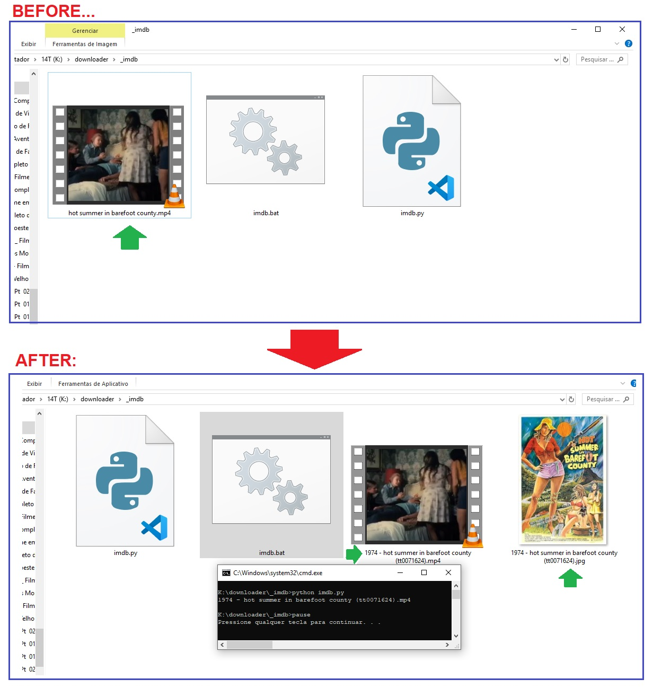

# IMDB VIDEO CATALOGER by Ricardo Madela

With this program, you can organize all the films in your library, including their release date and cover image with just one click. In addition, the IMDB code is inserted in the name, to make it easier to find more information.

Com este programa, você pode organizar todos os filmes da sua biblioteca, incluindo a data de seu lançamento e a imagem de sua capa com apenas um clique. Além disso, é inserido no nome o código IMDB, para facilitar a localização de mais informações.

## Installation

You will need to install some simple dependencies such as:

+ glob (pip install glob2)
+ moviepy (pip install moviepy)
+ BeautifulSoup (pip install bs4)

Congratulations! Enjoy~!

## Usage

Run the python script in the movies folder. It will catalog them all one by one. That simple...

If you liked it and want to help me:
BTC address: 32MEWcLH2cLLHJyGUGHpByph18QiTJAzSG

## Instalação

Você precisará instalar algumas dependências simples acima.

## Uso

Execute o script python na pasta dos filmes. Ele catalogará todos um a um. Simples assim...

Se gostou e quiser me ajudar:
BTC address: 32MEWcLH2cLLHJyGUGHpByph18QiTJAzSG
